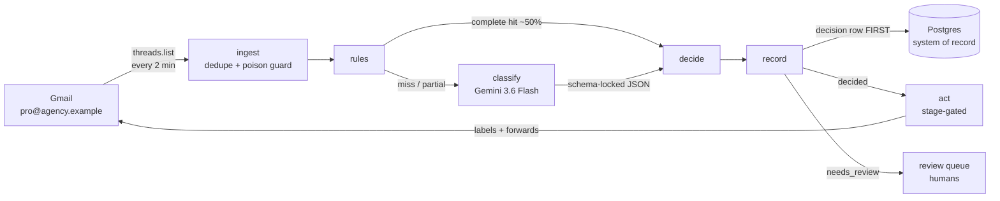

# Architecture

Audience: SWEs and system designers. For *why* each choice was made, see [decisions.md](decisions.md); for day-2 operation, see [operations.md](operations.md).

## Context

`pro@agency.example` is the operations intake mailbox of AGY, an insurance agency with a NY front office (judgment work) and a KR back-office processing center (commodity processing). ~4,700 threads arrive monthly. Human dispatchers triage each thread by applying **queue labels** (work type + owning team), **forwarding** to a desk alias, and later closing with a `DONE` label. This system automates the first two steps; completion marking stays human.

The label vocabulary is the existing 42 Gmail labels **verbatim** — including the `Cancelllation` triple-L misspelling, which is load-bearing (a test asserts it). Forwards go only to desk aliases (`invoice@`, `accounting@`, `express@agency.example`), never to individuals.

## Pipeline

One thread → one graph run. The graph is a LangGraph.js `StateGraph` (`src/graph/triage.ts`); nodes share a state object carrying the normalized email, rule evidence, classification, and decision.

Node by node:

| Node | Module | Behavior |
|---|---|---|
| ingest | `src/lib/ingest.ts` + `src/app/api/cron/ingest/route.ts` | Polls `threads.list` newer than a stored checkpoint; dedupes against `decisions`; runs the graph per new thread. Hardened: checkpoint clamping, 3-strike poison stubs (see below). |
| rules | `src/lib/rules.ts` | Data-driven patterns from the `rules` table (`sender_exact`, `sender_domain`, `list_id`, `subject_template`). A *complete* hit skips the LLM. Partial hits pass evidence into classify. Structural rule: `Cancelllation` co-emits `3-KR/DOCS&NOTICE`. |
| classify | `src/lib/classify.ts`, `prompt.ts` | Gemini 3.6 Flash via `@langchain/google-genai` `withStructuredOutput`. Zod schema locks labels to the 42-label vocabulary minus the DONE family, and forwards to the three desk aliases. One retry on failure/schema-invalid, then `null` → review. |
| decide | `src/lib/decide.ts` | A decision auto-acts only if the classifier said `high` **and** every emitted label is in the `autoActLabels` allow-list (per-category, eval-calibrated). Everything else → `needs_review`. Rule-complete decisions act at confidence `rule`. |
| record | `src/lib/decide.ts` (`recordDecision`) | Upserts `threads`, inserts the `decisions` row (rule hits, raw LLM output, final tasks, planned actions). **Graph topology guarantees this precedes act.** |
| act | `src/lib/act.ts` | Executes planned actions the current stage permits (see rollout). Each executed action is persisted immediately → idempotent; a retry can never double-send a forward. Failures mark the decision `failed` and stop. |

## Ingestion hardening

Lessons from the phase-0 extractor, encoded in `src/lib/ingest.ts`:

- **Duplicates over holes.** The checkpoint advances only past threads that are durably recorded. A crash between writes re-processes (dedupe absorbs it) rather than drops.
- **Dedupe keys off `decisions`, not `threads`** — `recordDecision` writes `threads` before `decisions`, so a crash between the two would otherwise leave a thread "seen" but never triaged.
- **Poison threads: 3 strikes.** A thread that deterministically crashes the graph clamps the checkpoint (so it's retried next run) and increments `ingest_failures`. At 3 strikes it is stubbed as a `failed` decision — visible to humans, no longer wedging the pipeline.
- **Dead-man watchdog** (`src/app/api/cron/watchdog/route.ts`, every 15 min): alerts `ALERT_EMAIL` if no ingest has succeeded in 15 minutes.

## Data model

Postgres is the system of record; migrations in `migrations/`.

| Table | Purpose |
|---|---|
| `threads` | One row per ingested thread: arrival-time snapshot (from, subject, attachments, list-id, 1,200-char body excerpt). |
| `decisions` | **The audit log.** Stage, rule hits, raw LLM output, final task set, confidence, status (`decided` / `needs_review` / `acted` / `failed`), planned vs executed actions, error detail. Every Gmail write traces to a row here. |
| `reviews` | Human corrections from the (future) dashboard; feeds rules/prompt tuning. |
| `rules` | The rules engine's patterns — data, not code. Seeded from phase-0 high-purity tables (`npm run seed-rules`); source tracked (`phase0` / `learned` / `manual`). |
| `app_config` | Runtime config: `stage` flag and `autoActLabels` allow-list. The kill switch lives here. |
| `ingest_state` | Checkpoint (ms) + last-success timestamp (watchdog reads this). |
| `ingest_failures` | Per-thread strike counter with last error. |

## Gmail authorization

Per-mailbox OAuth (decided 2026-08-06; DWD declined — see [decisions.md](decisions.md#adr-9)):

- A Desktop-app OAuth client (Internal consent screen) + a refresh token granted by `pro@agency.example` itself via `npm run authorize-gmail`.
- Blast radius is that single mailbox; the grant is visible and revocable from the account's security page.
- Scopes: `gmail.modify` + `gmail.send`. `src/lib/gmail.ts` prefers OAuth when `GOOGLE_OAUTH_CLIENT_ID` is set; the service-account/DWD path remains in code as an unused alternative.
- If pro@'s password changes, Google revokes the token → re-run `authorize-gmail`. The watchdog surfaces the outage within 15 minutes.

## Deployment shape (Task 12, pending)

Vercel-hosted Next.js app. Two crons (`vercel.json`): ingest `*/2`, watchdog `*/15`, both requiring `Authorization: Bearer $CRON_SECRET`. Postgres provisioned via Vercel Marketplace. No public routes besides the cron endpoints; the dashboard (review queue, audit log, metrics) is a separate follow-up plan.

## Failure philosophy

**Fail toward humans, never fail-open.** The designed failure mode is an unclassified email reaching the review queue. The complexity budget is spent preventing the opposite failure — a wrong automated action:

1. Vocabulary locked at the schema (can't invent labels; can't emit DONE).
2. Classifier failure → retry once → review. Null never acts.
3. Per-category allow-list gates auto-action independently of the model's stated confidence.
4. Decision row precedes action, structurally.
5. Actions idempotent per-action; forwards can't double-send.
6. Stage flag caps what act may do at all; reverting to shadow is one config write.
